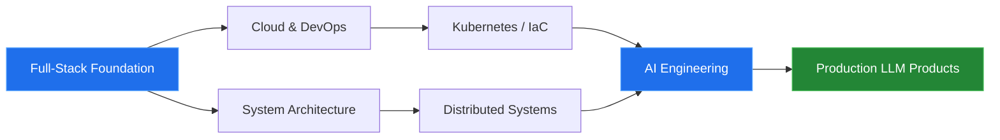

<!-- ══════════════════════════════════════════════════════════════
     HEADER — animated wave + typing effect
══════════════════════════════════════════════════════════════ -->

<div align="center">


<a href="https://batsuren-dev.netlify.app">
  
</a>

<br/>

<a href="https://batsuren-dev.netlify.app">
  
</a>
<a href="https://github.com/Batsuren02">
  
</a>
<a href="mailto:your.email@example.com">
  
</a>
<a href="https://linkedin.com/in/your-handle">
  
</a>

<br/><br/>


</div>


<!-- ══════════════════════════════════════════════════════════════
     ABOUT
══════════════════════════════════════════════════════════════ -->

##  &nbsp;About Me

```csharp
public class Batsuren : SoftwareEngineer
{
    public string Location   => "Ulaanbaatar, Mongolia 🇲🇳";
    public string Role       => "Full-Stack Engineer";

    public string[] Focus    => new[]
    {
        "Flutter mobile apps",
        "Odoo ERP & enterprise workflows",
        ".NET / Django backends",
        "LLM-powered products & AI agents"
    };

    public string[] Learning => new[] { "Cloud", "DevOps", "System Architecture" };

    public string Philosophy => "Ship it, measure it, refactor it.";
}
```

<table>
<tr>
<td width="50%" valign="top">

**🎯 Одоо юу хийж байна**
- Enterprise түвшний loan management platform хөгжүүлж байна
- Flutter дээр production mobile app-уудыг release хийж байна
- Odoo ERP модулиудыг захиалгаар бүтээж байна

</td>
<td width="50%" valign="top">

**🌱 Одоо юу сурч байна**
- Cloud infrastructure болон CI/CD pipeline
- Distributed system design, scaling patterns
- LLM application, RAG, AI agent architecture

</td>
</tr>
</table>

<!-- ══════════════════════════════════════════════════════════════
     TECH STACK
══════════════════════════════════════════════════════════════ -->

##  &nbsp;Tech Stack

<div align="center">

<h4>Mobile</h4>


<h4>Backend</h4>


<h4>Frontend</h4>


<h4>Database & Infra</h4>


</div>

<details>
<summary><b>📦 Дэлгэрэнгүй жагсаалт (дарж нээнэ үү)</b></summary>

<br/>

| Ангилал | Технологиуд |
|---|---|
| **Languages** | C#, Dart, Python, TypeScript, JavaScript, SQL |
| **Mobile** | Flutter, Riverpod, Bloc, GoRouter, Firebase |
| **Backend** | ASP.NET Core, Entity Framework, Django, DRF, Celery |
| **Frontend** | React, Next.js, Tailwind CSS, Zustand, React Query |
| **ERP** | Odoo (custom modules, OWL, QWeb, XML-RPC) |
| **Database** | PostgreSQL, SQL Server, MySQL, Redis |
| **DevOps** | Docker, Docker Compose, GitHub Actions, Nginx, Linux (Ubuntu) |
| **AI / LLM** | OpenAI API, Anthropic API, LangChain, vector database, RAG |
| **Tools** | Git, Postman, Figma, VS Code, Rider |

</details>

<!-- ══════════════════════════════════════════════════════════════
     PROJECTS
══════════════════════════════════════════════════════════════ -->

##  &nbsp;Featured Projects

<div align="center">
<table>
<tr>
<td width="50%" valign="top">

### 📱 MobiApp
> Flutter дээр бүтээсэн cross-platform mobile application. Riverpod state management, offline-first өгөгдлийн давхарга, REST API integration.

`Flutter` `Dart` `Riverpod` `REST API`

<a href="https://github.com/Batsuren02?tab=repositories">
  
</a>

</td>
<td width="50%" valign="top">

### 🏦 Loan Management Platform
> Санхүүгийн байгууллагад зориулсан enterprise систем. ERP маягийн workflow, зээлийн эргэн төлөлтийн тооцоолол, role-based access control.

`.NET` `PostgreSQL` `React` `Docker`

<a href="https://github.com/Batsuren02?tab=repositories">
  
</a>

</td>
</tr>
<tr>
<td width="50%" valign="top">

### 🤖 AI Engineering Lab
> LLM, automation, AI agent-уудтай хийсэн туршилтуудын цуглуулга. Prompt engineering, RAG pipeline, tool calling.

`Python` `LangChain` `LLM` `RAG`

<a href="https://github.com/Batsuren02?tab=repositories">
  
</a>

</td>
<td width="50%" valign="top">

### 🏢 Odoo ERP Modules
> Бизнесийн процесст тохируулсан custom Odoo модулиуд. Нягтлан бодох бүртгэл, агуулах, борлуулалтын automation.

`Odoo` `Python` `XML` `PostgreSQL`

<a href="https://github.com/Batsuren02?tab=repositories">
  
</a>

</td>
</tr>
</table>
</div>

<!-- ══════════════════════════════════════════════════════════════
     GITHUB ANALYTICS
══════════════════════════════════════════════════════════════ -->

##  &nbsp;GitHub Analytics

<div align="center">


<br/><br/>


<br/><br/>


</div>

<!-- ══════════════════════════════════════════════════════════════
     CONTRIBUTION SNAKE (requires GitHub Action — see snake.yml)
══════════════════════════════════════════════════════════════ -->

<div align="center">

### 🐍 Contribution Graph

<picture>
  <source media="(prefers-color-scheme: dark)" srcset="https://raw.githubusercontent.com/Batsuren02/Batsuren02/output/github-snake-dark.svg" />
  <source media="(prefers-color-scheme: light)" srcset="https://raw.githubusercontent.com/Batsuren02/Batsuren02/output/github-snake.svg" />
  
</picture>

</div>

<!-- ══════════════════════════════════════════════════════════════
     ROADMAP
══════════════════════════════════════════════════════════════ -->

##  &nbsp;Current Roadmap



<details>
<summary><b>🎯 2026 зорилтууд</b></summary>

<br/>

- [ ] AWS эсвэл Azure-ийн cloud certification авах
- [ ] Kubernetes дээр production workload deploy хийх
- [ ] Open source төсөлд тогтмол contribution хийх
- [ ] AI agent-д суурилсан SaaS product launch хийх
- [ ] System design болон scalability талаар техникийн блог бичих

</details>

<!-- ══════════════════════════════════════════════════════════════
     FOOTER
══════════════════════════════════════════════════════════════ -->

<div align="center">


<br/><br/>

### 💬 Let's build something

Шинэ төсөл, хамтын ажиллагаа, эсвэл зүгээр л технологийн талаар ярилцах уу — нээлттэй байна.

<a href="https://batsuren-dev.netlify.app">
  
</a>

<br/><br/>


<sub>⭐️ Хэрэв ямар нэг repo тань таалагдвал star дарж дэмжээрэй</sub>

</div>
