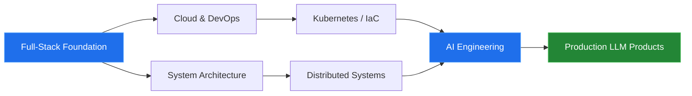

<!-- ══════════════════════════════════════════════════════════════
     SECTION 01 — HERO
══════════════════════════════════════════════════════════════ -->

<div align="center">


</div>

```
██████╗  █████╗ ████████╗███████╗██╗   ██╗██████╗ ███████╗███╗   ██╗
██╔══██╗██╔══██╗╚══██╔══╝██╔════╝██║   ██║██╔══██╗██╔════╝████╗  ██║
██████╔╝███████║   ██║   ███████╗██║   ██║██████╔╝█████╗  ██╔██╗ ██║
██╔══██╗██╔══██║   ██║   ╚════██║██║   ██║██╔══██╗██╔══╝  ██║╚██╗██║
██████╔╝██║  ██║   ██║   ███████║╚██████╔╝██║  ██║███████╗██║ ╚████║
╚═════╝ ╚═╝  ╚═╝   ╚═╝   ╚══════╝ ╚═════╝ ╚═╝  ╚═╝╚══════╝╚═╝  ╚═══╝

   F U L L - S T A C K   E N G I N E E R  ·  U L A A N B A A T A R
```

<div align="center">

<a href="https://batsuren-dev.netlify.app">
  
</a>

</div>

---

<!-- ══════════════════════════════════════════════════════════════
     SECTION 02 — SYSTEM SCAN
══════════════════════════════════════════════════════════════ -->

```yaml
╭─ PROFILE ──────────────────────────────────────────────────────────╮
│                                                                    │
│   handle      : @Batsuren02                                        │
│   role        : Full-Stack Engineer                                │
│   location    : Ulaanbaatar, Mongolia (UTC+8)                      │
│   domain      : ERP · financial platforms · mobile                 │
│   languages   : Mongolian (native) · English (professional)        │
│   status      : open to enterprise & Flutter work                  │
│                                                                    │
╰────────────────────────────────────────────────────────────────────╯
```

I build **ERP and financial platforms** for companies in Mongolia — systems with many user roles,
strict permission rules, and data that has to be correct the first time. From the mobile client down
to the database schema and the deployment pipeline, I own the whole path.

> Most of this work lives in private client repositories. The public activity below is only a slice of it.

---

<!-- ══════════════════════════════════════════════════════════════
     SECTION 03 — CURRENTLY
══════════════════════════════════════════════════════════════ -->


```console
$ batsuren --status --verbose

  [ building  ]  Loan management platform
                 └─ repayment engine · role-based access · audit trail

  [ shipping  ]  Flutter apps in production on Android and iOS

  [ extending ]  Custom Odoo modules — accounting, inventory, sales

  [ learning  ]  Kubernetes and IaC
                 └─ first production cluster targeted Q4 2026

  [ exploring ]  RAG pipelines and tool-calling agents

  last reviewed: 2026-08
```

---

<!-- ══════════════════════════════════════════════════════════════
     SECTION 04 — STACK
══════════════════════════════════════════════════════════════ -->


<div align="center">
<br/>


<sub><b>DAILY DRIVERS</b> — what I write most weeks</sub>

<br/><br/>


<sub><b>REGULAR USE</b> — comfortable, shipped with</sub>

<br/><br/>


<sub><b>WORKING KNOWLEDGE</b> — can be productive, still deepening</sub>

<br/>
</div>

<details>
<summary>&nbsp;<b>Full breakdown</b></summary>

<br/>

| Layer | Technologies |
|---|---|
| **Languages** | C#, Dart, Python, TypeScript, JavaScript, SQL |
| **Mobile** | Flutter, Riverpod, Bloc, GoRouter, Firebase |
| **Backend** | ASP.NET Core, Entity Framework, Django, DRF, Celery |
| **Frontend** | React, Next.js, Tailwind CSS, Zustand, React Query |
| **ERP** | Odoo — custom modules, OWL, QWeb, XML-RPC |
| **Data** | PostgreSQL, SQL Server, MySQL, Redis |
| **Infra** | Docker, Docker Compose, GitHub Actions, Nginx, Ubuntu |
| **AI / LLM** | Anthropic API, OpenAI API, LangChain, vector databases, RAG |

</details>

---

<!-- ══════════════════════════════════════════════════════════════
     SECTION 05 — PRINCIPLES
══════════════════════════════════════════════════════════════ -->


<table>
<tr>
<td width="33%" valign="top">

`01` &nbsp;**ARCHITECTURE FIRST**

The data model and its boundaries get settled before the first line of code. Changing them later is the expensive part.

</td>
<td width="33%" valign="top">

`02` &nbsp;**BORING TECH WINS**

New frameworks are fun. In production, the stack with stable releases and real documentation is the one that survives.

</td>
<td width="33%" valign="top">

`03` &nbsp;**TEST WHERE IT HURTS**

Not 100% coverage. Heavy guarantees around money, permissions, and data integrity — light everywhere else.

</td>
</tr>
<tr>
<td valign="top">

`04` &nbsp;**SHIP SMALL, SHIP OFTEN**

Large releases get sliced into short cycles. The faster feedback arrives, the cheaper the mistakes are.

</td>
<td valign="top">

`05` &nbsp;**DOCS ARE CODE**

Without a README, ADRs, and API docs, a system only works for whoever wrote it. That is a liability.

</td>
<td valign="top">

`06` &nbsp;**OBSERVABILITY BY DEFAULT**

Logs, metrics, and alerts go in on day one. A system you cannot see into is a system you cannot operate.

</td>
</tr>
</table>

---

<!-- ══════════════════════════════════════════════════════════════
     SECTION 06 — ACTIVITY
══════════════════════════════════════════════════════════════ -->


<div align="center">
<br/>


<br/><br/>

<picture>
  <source media="(prefers-color-scheme: dark)" srcset="https://raw.githubusercontent.com/Batsuren02/Batsuren02/output/github-snake-dark.svg" />
  <source media="(prefers-color-scheme: light)" srcset="https://raw.githubusercontent.com/Batsuren02/Batsuren02/output/github-snake.svg" />
  
</picture>

</div>

---

<!-- ══════════════════════════════════════════════════════════════
     SECTION 07 — TRAJECTORY
══════════════════════════════════════════════════════════════ -->




<details>
<summary>&nbsp;<b>Milestones</b></summary>

<br/>

| Milestone | Status |
|---|---|
| Automated CI/CD across all active projects | ✅ &nbsp;Done — Mar 2026 |
| First production deployment on Kubernetes | ◐ &nbsp;Targeting Q4 2026 |
| AWS or Azure cloud certification | ◐ &nbsp;In progress |
| Ship an LLM-powered product with real users | ○ &nbsp;Planned — 2027 |
| Write publicly about system design | ○ &nbsp;Planned |

</details>

---

<!-- ══════════════════════════════════════════════════════════════
     SECTION 08 — CONTACT
══════════════════════════════════════════════════════════════ -->


Open to enterprise systems work, ERP builds, and Flutter projects.
The fastest way to reach me is email.

<a href="mailto:batsurenbataa665@gmail.com">
  
</a>
&nbsp;
<a href="https://batsuren-dev.netlify.app">
  
</a>

<div align="center">


</div>
