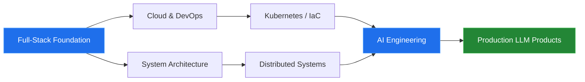

<!-- ══════════════════════════════════════════════════════════════
     HEADER
══════════════════════════════════════════════════════════════ -->

 

  

<!-- ══════════════════════════════════════════════════════════════
     ABOUT
══════════════════════════════════════════════════════════════ -->

##  &nbsp;About Me

> I design and ship software that runs a business — from the mobile client, through the API layer,
> down to the database schema and the deployment pipeline. Most of my work lives in private client
> repositories, so the public activity below reflects only a slice of what I actually build.

<table>
<tr>
<td width="55%" valign="top">

**What I focus on**

`Enterprise ERP & business process automation`
`Financial platforms with complex workflows`
`Cross-platform mobile applications`
`AI-powered tools & LLM integrations`

**What I'm sharpening right now**

`Cloud infrastructure` `DevOps & CI/CD`
`Distributed system design` `AI engineering`

</td>
<td width="45%" valign="top">

| | |
|---|---|
| 📍 | Ulaanbaatar, Mongolia |
| 💼 | Full-Stack Engineer |
| 🧰 | Flutter · .NET · Django · Odoo |
| 🗄️ | PostgreSQL · SQL Server · Redis |
| 🌐 | English · Mongolian |
| ⚡ | Boring tech, shipped on time |

</td>
</tr>
</table>

**Where I add the most value**

- Enterprise systems with many roles, permission layers, and strict data-integrity requirements
- Integrating with legacy codebases and third-party APIs that were never designed to be integrated with
- Owning the full path from idea to production: architecture, implementation, deployment, and support

<!-- ══════════════════════════════════════════════════════════════
     TECH STACK
══════════════════════════════════════════════════════════════ -->

##  &nbsp;Tech Stack

<h4>Mobile</h4>

<h4>Backend</h4>

<h4>Frontend</h4>

<h4>Database & Infra</h4>

<b>📦 Full breakdown (click to expand)</b>

 

| Category | Technologies |
|---|---|
| **Languages** | C#, Dart, Python, TypeScript, JavaScript, SQL |
| **Mobile** | Flutter, Riverpod, Bloc, GoRouter, Firebase |
| **Backend** | ASP.NET Core, Entity Framework, Django, DRF, Celery |
| **Frontend** | React, Next.js, Tailwind CSS, Zustand, React Query |
| **ERP** | Odoo (custom modules, OWL, QWeb, XML-RPC) |
| **Database** | PostgreSQL, SQL Server, MySQL, Redis |
| **DevOps** | Docker, Docker Compose, GitHub Actions, Nginx, Linux (Ubuntu) |
| **AI / LLM** | OpenAI API, Anthropic API, LangChain, vector databases, RAG |
| **Tools** | Git, Postman, Figma, VS Code, Rider |

<!-- ══════════════════════════════════════════════════════════════
     HOW I WORK
══════════════════════════════════════════════════════════════ -->

##  &nbsp;How I Work

<table>
<tr>
<td width="33%" valign="top">

### 🧱 Architecture first
Data model and boundaries get decided before the first line of code. Changing them later is the expensive part.

</td>
<td width="33%" valign="top">

### 🔁 Ship small, ship often
Large releases get sliced into short cycles. The faster feedback arrives, the cheaper mistakes are.

</td>
<td width="33%" valign="top">

### 📉 Boring tech wins
New frameworks are fun. In production, the stack with stable releases and real documentation wins.

</td>
</tr>
<tr>
<td width="33%" valign="top">

### 🧪 Test where it hurts
Not 100% coverage — heavy guarantees around money, permissions, and data integrity, light everywhere else.

</td>
<td width="33%" valign="top">

### 📝 Docs are code
Without a README, ADRs, and API docs, a system only works for the person who wrote it. That is a liability.

</td>
<td width="33%" valign="top">

### 👀 Observability by default
Logs, metrics, and alerts go in from day one. A system you can't see into is a system you can't operate.

</td>
</tr>
</table>

<!-- ══════════════════════════════════════════════════════════════
     GITHUB ANALYTICS
══════════════════════════════════════════════════════════════ -->

##  &nbsp;GitHub Analytics

  

  

  

 

ℹ️ Most of my production work sits in private repositories — these numbers show only part of the picture.

<!-- ══════════════════════════════════════════════════════════════
     CONTRIBUTION SNAKE (requires .github/workflows/snake.yml)
══════════════════════════════════════════════════════════════ -->

### 🐍 Contribution Graph

<picture>
  <source media="(prefers-color-scheme: dark)" srcset="https://raw.githubusercontent.com/Batsuren02/Batsuren02/output/github-snake-dark.svg" />
  <source media="(prefers-color-scheme: light)" srcset="https://raw.githubusercontent.com/Batsuren02/Batsuren02/output/github-snake.svg" />
  
</picture>

<!-- ══════════════════════════════════════════════════════════════
     ROADMAP
══════════════════════════════════════════════════════════════ -->

##  &nbsp;Engineering Roadmap

<b>🎯 2026 goals</b>

 

| Goal | Track | Status |
|---|---|:---:|
| Cloud certification (AWS / Azure) | Infrastructure | 🟡 In progress |
| Run a production workload on Kubernetes | DevOps | 🟡 In progress |
| Fully automated CI/CD pipeline | DevOps | 🟢 Done |
| Launch an AI agent-based product | AI | 🔴 Not started |
| Write technical posts on system design | Writing | 🔴 Not started |
| Consistent open source contributions | Community | 🟡 In progress |

<!-- ══════════════════════════════════════════════════════════════
     FOOTER
══════════════════════════════════════════════════════════════ -->

  

### 💬 Let's build something

Open to new projects, collaborations, or just a good conversation about engineering.

  

⭐️ If any of my repos help you, a star goes a long way

