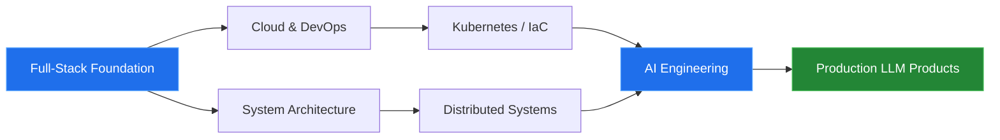

<!-- ══════════════════════════════════════════════════════════════
     HEADER
══════════════════════════════════════════════════════════════ -->

<!-- ══════════════════════════════════════════════════════════════
     IDENTITY  —  one sentence, present tense
══════════════════════════════════════════════════════════════ -->

I build **ERP and financial platforms** for companies in Mongolia — the kind with many user roles,
strict permission rules, and data that has to be right the first time. Mobile client through to
database schema and deployment, I own the whole path.

Most of this work lives in private client repositories, so the public activity below shows only a slice of it.

<!-- ══════════════════════════════════════════════════════════════
     CURRENTLY  —  dated, specific, replaces "I'm learning X"
══════════════════════════════════════════════════════════════ -->

### ⚡ Currently

| | |
|---|---|
| 🔨 **Building** | Loan management platform — repayment engine, role-based access, audit trail |
| 📱 **Shipping** | Flutter apps in production on Android & iOS |
| 🧩 **Extending** | Custom Odoo modules for accounting, inventory, and sales automation |
| ☁️ **Learning** | Kubernetes and IaC — first production cluster targeted for Q4 2026 |
| 🤖 **Exploring** | RAG pipelines and tool-calling agents on the Anthropic & OpenAI APIs |

Last reviewed: August 2026

<!-- ══════════════════════════════════════════════════════════════
     TECH STACK  —  ordered by depth, not alphabet
══════════════════════════════════════════════════════════════ -->

##  &nbsp;Tech Stack

<h4>Daily drivers</h4>

<h4>Regular use</h4>

<h4>Working knowledge</h4>

<b>📦 Full breakdown</b>

 

| Category | Technologies |
|---|---|
| **Languages** | C#, Dart, Python, TypeScript, JavaScript, SQL |
| **Mobile** | Flutter, Riverpod, Bloc, GoRouter, Firebase |
| **Backend** | ASP.NET Core, Entity Framework, Django, DRF, Celery |
| **Frontend** | React, Next.js, Tailwind CSS, Zustand, React Query |
| **ERP** | Odoo — custom modules, OWL, QWeb, XML-RPC |
| **Data** | PostgreSQL, SQL Server, MySQL, Redis |
| **Infra** | Docker, Docker Compose, GitHub Actions, Nginx, Ubuntu |
| **AI / LLM** | Anthropic API, OpenAI API, LangChain, vector databases, RAG |

<!-- ══════════════════════════════════════════════════════════════
     HOW I WORK  —  the differentiator; almost no profile has this
══════════════════════════════════════════════════════════════ -->

##  &nbsp;How I Work

<table>
<tr>
<td width="33%" valign="top">

**🧱 Architecture first**

The data model and its boundaries get settled before the first line of code. Changing them later is the expensive part.

</td>
<td width="33%" valign="top">

**📉 Boring tech wins**

New frameworks are fun. In production, the stack with stable releases and real documentation is the one that survives.

</td>
<td width="33%" valign="top">

**🧪 Test where it hurts**

Not 100% coverage. Heavy guarantees around money, permissions, and data integrity — light everywhere else.

</td>
</tr>
<tr>
<td width="33%" valign="top">

**🔁 Ship small, ship often**

Large releases get sliced into short cycles. The faster feedback arrives, the cheaper the mistakes are.

</td>
<td width="33%" valign="top">

**📝 Docs are code**

Without a README, ADRs, and API docs, a system only works for whoever wrote it. That is a liability, not a feature.

</td>
<td width="33%" valign="top">

**👀 Observability by default**

Logs, metrics, and alerts go in on day one. A system you cannot see into is a system you cannot operate.

</td>
</tr>
</table>

<!-- ══════════════════════════════════════════════════════════════
     ACTIVITY  —  one stats card + the contribution graph. That's it.
══════════════════════════════════════════════════════════════ -->

##  &nbsp;Activity

  

<picture>
  <source media="(prefers-color-scheme: dark)" srcset="https://raw.githubusercontent.com/Batsuren02/Batsuren02/output/github-snake-dark.svg" />
  <source media="(prefers-color-scheme: light)" srcset="https://raw.githubusercontent.com/Batsuren02/Batsuren02/output/github-snake.svg" />
  
</picture>

<!-- ══════════════════════════════════════════════════════════════
     ROADMAP
══════════════════════════════════════════════════════════════ -->

##  &nbsp;Where I'm Headed

<b>🎯 Milestones</b>

 

| Milestone | Status |
|---|---|
| Automated CI/CD pipeline across all active projects | ✅ Done — Mar 2026 |
| First production deployment on Kubernetes | 🟡 Targeting Q4 2026 |
| AWS or Azure cloud certification | 🟡 In progress |
| Ship an LLM-powered product with real users | 🔴 Planned — 2027 |
| Write publicly about system design | 🔴 Planned |

<!-- ══════════════════════════════════════════════════════════════
     ONE EXIT
══════════════════════════════════════════════════════════════ -->

## 📬 Get in touch

Open to enterprise systems work, ERP builds, and Flutter projects. The fastest way to reach me is email.

&nbsp;

